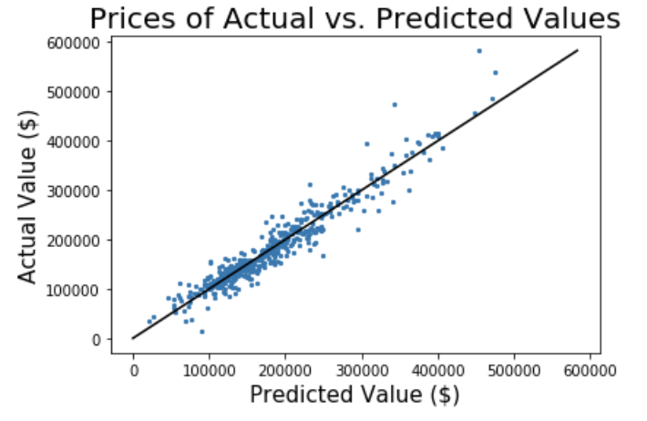

# **Project 2: Ames Housing Data and Kaggle Challenge**

## **Overview**
The objective of this project is to create a Linear Regression Model that predicts the sale price of properties in Ames, Iowa. A model is created with training data that was provided to us and predictions will be made on a test data that does **NOT** have the actual sale prices available to us. The predictions will be submitted onto Kaggle and our Root Mean Squared Error will be calculated for our predictions vs. actual values.

## **Data Dictionary**
Having this link open while going through the code may be helpful in understanding the specific features:
http://jse.amstat.org/v19n3/decock/DataDocumentation.txt

## **Data Cleaning**
Many of the columns had NaN values in them.
- Rows that had a NaN value as a string, I cross checked if the area for that specific variable was 0 sq. ft. and concluded that the NaN values could be converted to NA. (ie. NA = No basement 1, No pool, etc.)

Some rows had an entire categorical variable missing. (ie. Basement, Basement Sq. Ft., Basement Full Bath, etc.)
- I concluded that these variables are important to help determine the price of a property and decided to remove rows like these so they wouldn't affect my model.

Outliers:
- While looking at my outliers post-modeling, I noticed that some properties were huge with many rooms and bathrooms but were sold at an extremely low price. I decided to drop these outliers.
- There were other outliers that were identified as outliers in multiple categories. These outliers were also dropped.

## **Model Process**
1. I dummied out every single categorical column in both train and test data.

2. I split my training data into one part that I could use to train my model and the other party so I could test it. In order to not clash with my original test data, I labeled this new test data as "holdout."
3. Identified variables I want to include my model.
  - I first started by determining which variables are definitely important to determining sale price of a property.
  - I created a for-loop that made Single Linear Regressions for each individual variable against Sale Price and added that variable name to a list if it affects sale price by at least +/- 30,000.

4. I ran my model and obtained the scores of the training set, the holdout set, and a cross value score of the training set.

5. I used PolyNomialFeatures to create interactions of every numerical column in my original dataset. I used Lasso to identify which interactions were the most effective and I added those to my Linear Regression Model and re-ran it.

## **Summary**
Multiple submissions were made on Kaggle. My best model has a Root Mean Squared Error of 23,808.780 against the Kaggle test data.

The following are scores obtained from my training and holdout data:

|Metric|Score|
|------|----------|
|**R2 Score (Train Data)**|93.95%|
|**R2 Score (Holdout Data)**|92.11%|
|**Cross Value Score, 5 Folds (Train Data)**|92.00%|
|**Root Mean Squared Error**|$21,941.01|
|**Mean Absolute Error**|$15314.41|
|**Mean of Residuals**|$758.53|

## **Sources**
- https://stackoverflow.com/questions/49065837/customize-the-axis-label-in-seaborn-jointplot
- https://stackoverflow.com/questions/34001751/python-how-to-increase-reduce-the-fontsize-of-x-and-y-tick-labels/34004236
- https://stackoverflow.com/questions/29813694/how-to-add-a-title-to-seaborn-facet-plot
- https://stackoverflow.com/questions/28638158/seaborn-facetgrid-how-to-leave-proper-space-on-top-for-suptitle
- https://blog.goodaudience.com/jupyter-notebooks-the-real-way-to-use-them-5b4417ea77ba
- https://stackoverflow.com/questions/28914078/filter-out-rows-based-on-list-of-strings-in-pandas
- https://stackoverflow.com/questions/14463277/how-to-disable-python-warnings
